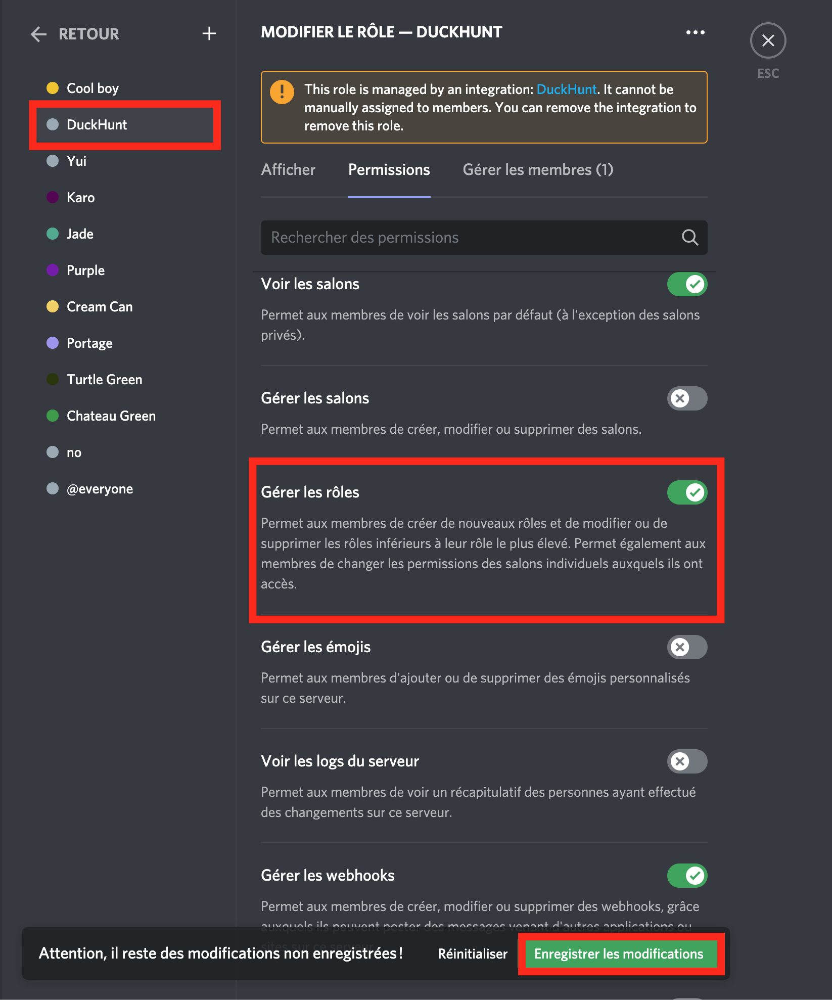
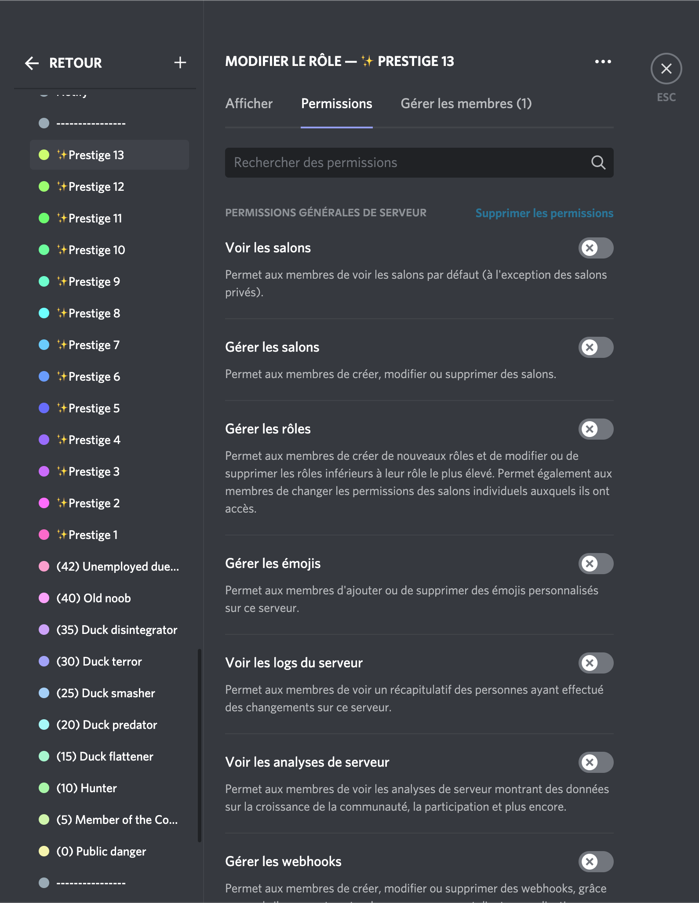
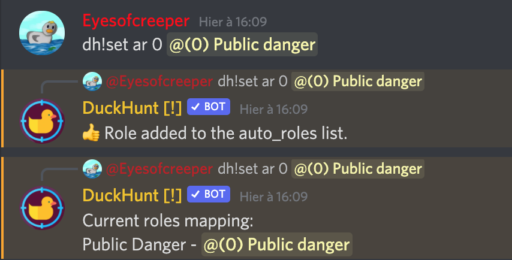
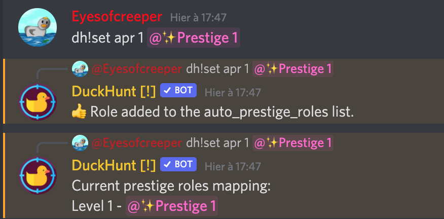
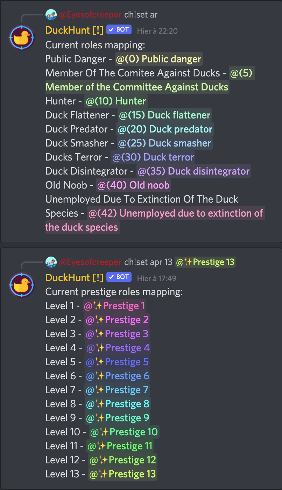

# Rôles \(prestige\) automatiques

Ce guide vous apprendra à utiliser les commandes [auto\_roles](https://duckhunt.me/commands/settings/auto_roles) et [auto\_prestige\_roles](https://duckhunt.me/commands/settings/auto_prestige_roles).

Ces commandes sont utilisées pour que DuckHunt donne des rôles aux utilisateurs lorsqu'ils atteignent un [niveau](../players-guide/levels-and-experience.md) spécifique ou un [niveau de prestige](../players-guide/levels-and-experience.md) dans le jeu.

## Permissions

Tout d'abord, pour que le robot puisse ajouter des rôles, vous devez ajouter la permission `MANAGE_ROLES` à DuckHunt.

Pour cela, allez dans les paramètres de votre serveur, et sélectionnez le rôle DuckHunt, l'onglet des permissions, et assurez-vous que `MANAGE_ROLES` est activé.

N'oubliez pas de sauvegarder avant de poursuivre.

## Créer les rôles

Il est maintenant temps pour vous de créer les rôles que vous souhaitez. Cliquez sur le bouton ➕ en haut de la liste des rôles, et ajoutez des rôles un par un, en commençant par le plus élevé.


CONSEIL : Vous voudrez probablement ajouter de jolies couleurs pastel à vos rôles. Ce que vous voulez ici est un dégradé de couleurs, et vous pouvez trouver un outil qui les génère [ici](https://www.colorhexa.com/ccff66-to-ff66cc). Il suffit d'entrer votre couleur de départ et d'arrivée, et de copier les couleurs \#hex résultantes pour les ajouter dans Discord.


Vous pouvez créer des rôles pour les niveaux de DuckHunt et/ou des rôles pour les niveaux de prestige. Pour référence, voici la configuration que nous utilisons sur le serveur de DuckHunt.

La partie inférieure sont des rôles de niveau, tandis que la partie supérieure avec tous les ✨ sont des rôles de prestige. Notez que vous êtes libre de choisir les noms, les couleurs et les niveaux.

Comme il s'agira probablement de rôles cosmétiques, vous pouvez supprimer les autorisations en cliquant sur le bouton dans l'onglet des autorisations.

## Attribuer les rôles en tant que niveaux

Il est maintenant temps de définir les rôles. Dans votre canal de jeu, utilisez les commandes suivantes :

* `dh!settings auto_roles duckhunt_level @role`

* `dh!settings auto_prestige_roles prestige_level @role`

Ici, à votre premier niveau de prestige, vous aurez le rôle rose `✨Prestige 1` et à partir du niveau 0 de DuckHunt, vous aurez le rôle de `(0) Public danger` \(danger public\).

Vous devrez ajouter tous vos rôles. A la fin, sur le serveur de DuckHunt, comme ci-dessous :

