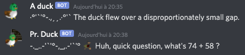

# Edit settings / Settings list

## What are settings

Settings are used to customize the hunting experience on your channel. \(✨ **New on V4:** settings are now per-channel.\)

## What are _all_ the settings ?

You can see settings you can access, and the permissions required to change them, you can view the [settings subcommand list](https://duckhunt.me/commands/settings).

This page is there to explain what exactly the settings do, and how to configure them. They are ordered here in an arbitrary order of "importance". The most important the setting is, the highest it'll be.

Note that some settings might now be shown here. Use the above link to view them all.

## Useful commands

You can use `dh!settings [your_setting_name]` to view the current setting value... Or you could also look at all the settings by doing `dh!settings` to get a link to your channel current settings. Don't forget to refresh the page after updating them ;\)

## Most important settings

### The server language

This is the language used on the server. Setting this will translate the bot messages to your server language.

To see all the available languages, use the [`dh!translators`](https://duckhunt.me/commands/translators) command.

Keep in mind that the bot is translated by humans like you. If you would like to see a language that isn't on that list, you can ask to [translate the bot](../players-guide/how-to-contribute-to-the-bot.md). In case a language is unfinished, some sentences might be sent in english instead.

Sometimes, you might see grammar mistakes or typos. In that case, please directly contact the translator to fix it, or give us a heads up on the [support server](https://discordapp.com/invite/2BksEkV).

### Ducks per day

The [`ducks_per_day`](https://duckhunt.me/commands/settings/ducks_per_day) setting controls the amount of ducks that will spawn during a 24-hour period. It is _not_ an exact number since some ducks aren't depleting that counter :

* Mechanical ducks bought from the shop
* Decoys that might bring ducks
* MOADs children

To prevent spam, the amount you can set here is limited. To increase the limit, you can [make your server VIP](../players-guide/how-to-contribute-to-the-bot.md), get more players to join your server and play with DuckHunt, or ask in the support server with a good reason.

To set the number of ducks per day, the command would be `d!settings ducks_per_day [amount]`, for example, typing `d!settings ducks_per_day 150` would give you 150 ducks per day, or approximately 6 every hour.

The related setting, [`ducks_time_to_live`](https://duckhunt.me/commands/settings/ducks_time_to_live) sets the time a duck will stay before leaving the pond.

### Experience-related settings

Every time a hunter kills a duck, they earn some experience. Experience is the game currency, and as such, you can make the game harder or easier by changing the following values.

There are four main settings to control that amount.

* [`base_duck_exp`](https://duckhunt.me/commands/settings/base_duck_exp) the amount a normal duck gives when killed
* [`per_life_exp`](https://duckhunt.me/commands/settings/per_life_exp) the amount added to the total for every life a duck has
* [`clover_min_experience`](https://duckhunt.me/commands/settings/clover_min_experience) the minimum amount a clover will give for every duck killed during the 24 hours following the purchase
* [`clover_max_experience`](https://duckhunt.me/commands/settings/clover_max_experience) the maximum value for a clover.

The total experience a hunter earns after killing a duck can be summarized by this formula :

`total = base_duck_exp + per_life_exp * (duck_lives-1) + clover_value`

Keep in mind that shop prices are fixed, and that changing the clover values will **not** affect existing clovers. To make the game easier, we recommend using the following commands :

* `dh!settings base_duck_exp 15`
* `dh!settings per_life_exp 13`
* `dh!settings clover_min_experience 5`
* `dh!settings clover_max_experience 13`

Adjust these values as needed.

### Super ducks lives

When a super duck spawn, it gets a certain amount of health. Two settings control how many lives a super duck can get.

* [`super_ducks_min_life`](https://duckhunt.me/commands/settings/super_ducks_min_life) the minimum hp a super duck can have
* [`super_ducks_max_life`](https://duckhunt.me/commands/settings/super_ducks_max_life) the maximum hp a super duck can have

Players can use some AP ammo, or some Explosive ammo to respectively double or triple the damage they do to ducks.

You can also decide to show the health left/total health of ducks using the [`show_duck_lives`](https://duckhunt.me/commands/settings/show_duck_lives) setting.

We recommend the following values :

* `dh!settings super_ducks_min_life 3` \(Don't set it lower than 2\)
* `dh!settings super_ducks_max_life 9` \(Set it to 7 if your gameplay is not competitive\)
* `dh!settings show_duck_lives False` \(Setting it to `True` would allow people to wait until the last possible moment before shooting\)

### Night

DuckHunt V4 allow you to set times when the nights start and ends on the channel. At night, different ducks appear, and they spawn less frequently. Note that times are given in `UTC`.

Set the times the night start and ends with the [`night_time`](https://duckhunt.me/commands/settings/night_time) command.

For example, if you want night to start at 21:30 UTC, and end at 6:20 UTC, you can use the following command :

`dh!settings night_time 21h30 6h20`

### Weights

Duck weights control the chance of a specific duck type to spawn. The higher the weight is, the higher the chance for a duck to be of that type.

### Webhooks

Webhooks are what make DuckHunt V4 special. They give special names and profile pictures to the bot, and look like this :

As you can see, the two ducks have different avatars and names. This is done using webhooks. To enable webhooks on your channel, make sure DuckHunt has the permission to create webhooks, and set [`use_webhooks`](https://duckhunt.me/commands/settings/use_webhooks) to true, like so `dh!settings use_webhooks True`

You can also add some webhooks with [`dh!settings add_webhook`](https://duckhunt.me/commands/settings/add_webhook) to prevent some lag due to discord ratelimits.

Note that it's useless to have more than 2 webhooks in use by DuckHunt for now, given current rate limits. Also note the discord limit of 10 webhooks per channel.

### Prefix

DuckHunt uses two types of prefixes : global prefixes \(`dh!`, `dh`, and @mention\), that you cannot change or edit, and a server prefix, used in your server. By default, the prefix used is `!`. If you find some other conflicts with DuckHunt, and you can't fix it using permissions, you can change your local prefix here. For example, if you wanted to use `$` instead, you could do [`dh!settings prefix $`](https://duckhunt.me/commands/settings/prefix).

### Annoyances

Some settings may make the bot mention players in some cases. Setting [`mentions_when_killed`](https://duckhunt.me/commands/settings/mentions_when_killed) to `False` will prevent DuckHunt from mentioning hunters if they get killed.

Additionally, players can disable mention when the bot replies to them by using the following command : [`dh!settings ping False`](https://duckhunt.me/commands/settings/ping). Note that this setting applies to an **user** account across all the servers where DuckHunt is. It cannot be configured per-channel.

Another setting is [`my_language`](https://duckhunt.me/commands/settings/my_language), that allow a **user** to set the language the bot should use when communicating with him in DMs.

If emojis make you lag, you can disable some of them using [`dh!settings use_emojis False`](https://duckhunt.me/commands/settings/use_emojis)

