# Types de canards

De nombreux canards peuvent apparaître sur votre canal, et il est de votre responsabilité de les reconnaître et d'agir de manière appropriée.

## Canards normaux

Ce canard est le canard "de base", celui que vous rencontrerez le plus souvent. Le tuer est facile : tapez simplement `dh!bang`, et il devrait mourir immédiatement \(si vous pouvez tirer, et si vous ne ratez pas votre tir\).

### Canard doré

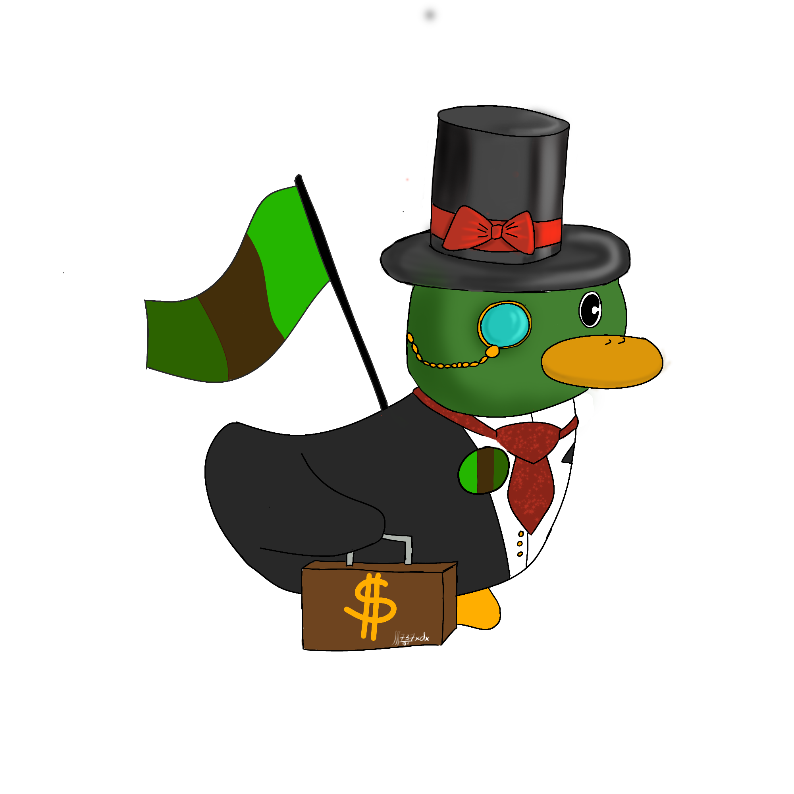

Ce canard vaut 1,5 fois plus d'expérience \(15 exp\). Assurez-vous de lui tirer dessus en premier.

### Canard en plastique

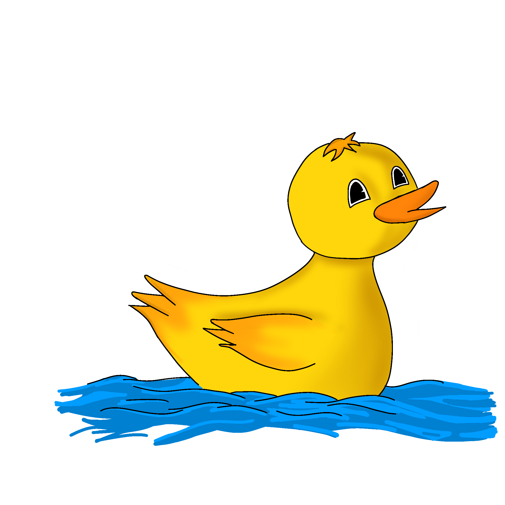

This duck will only give you half the experience of a normal duck \(5 exp\). On higher levels, it may not be worth it to shoot this duck.

### Kamikaze

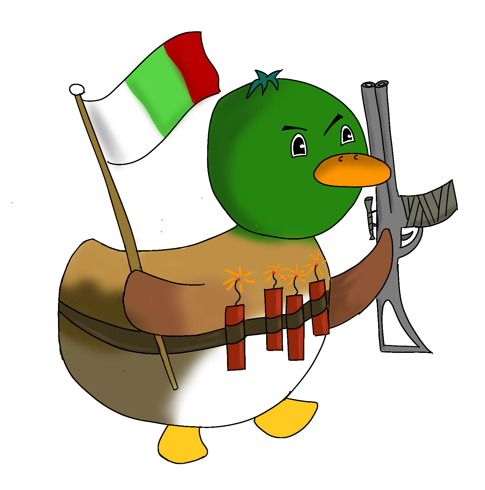

Ce canard est comme un canard normal, mais si vous le laissez seul trop longtemps, au lieu de s'éloigner, il va TUER tous les canards vivants sur le canal. N'attendez pas qu'il se dissparaisse !

### Canard fantôme

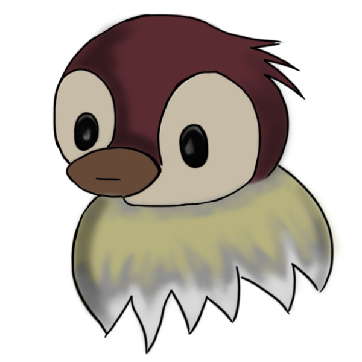

Ce canard n'envoie _pas_ de message d'apparition. Vous devez être vigilant si vous en tuez un : le canard que vous vouliez tuer n'est pas encore mort.

La meilleure façon de les trouver est de caliner l'air, car cela ne gaspille pas les balles.

### Prof \(Pr. Duck.\)

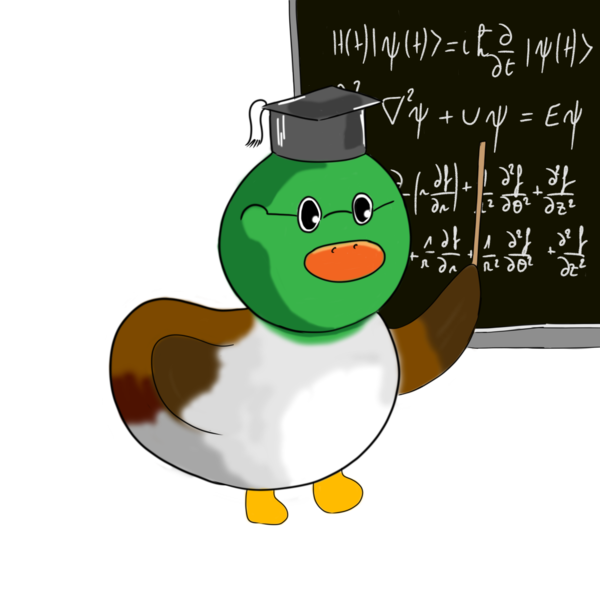

Le professeur vous demande de faire des calculs pour le tuer. Réponds à la question dans le message d'apparition. Pour le tuer, utilisez la commande `dh!pan <nombre>` . Par exemple, si vous voyez un professeur apparaitre avec

> Euh petite question, que font 16 + 91 ?

Vous devez utiliser `dh!pan 107` pour le tuer. Les mauvaises réponses vous **FERONT** perdre vos balle.

### Baby

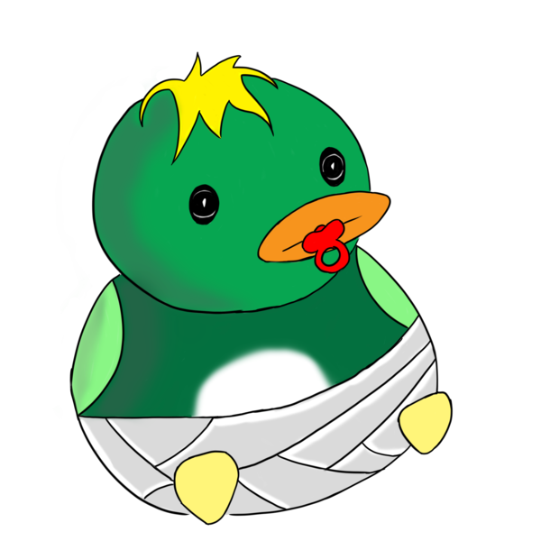

Ne tirez **pas** sur ce canard, cela vous coûterait un canard normal d'expérience \(10 exp\), et votre/vos balle\(s\) !

Au lieu de cela, vous devez `dh!hug` le canard pour le faire partir. Câliner les canards ne gaspillent pas vos balles.

### Mechanique

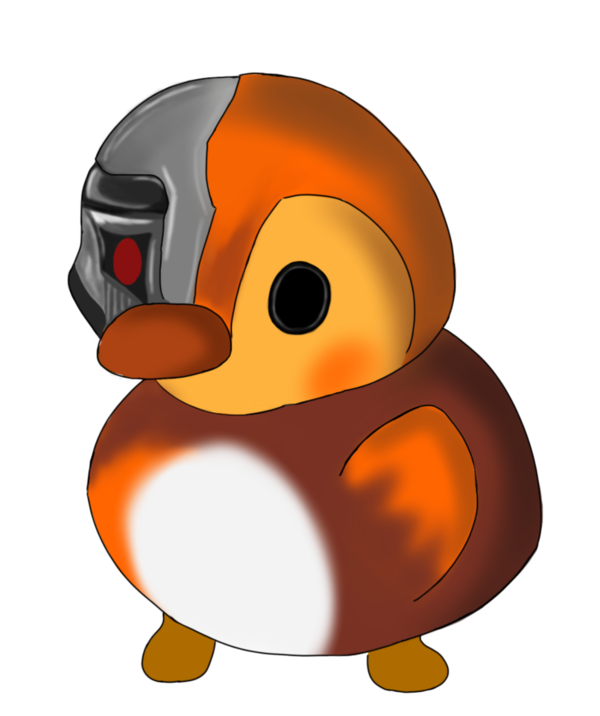

Techniquement, un canard mécanique n'est pas un canard, et on ne devrait pas lui tirer dessus. Ils peuvent parfois naître dans la nature, mais ils sont le plus souvent [achetés par d'autres chasseurs dans la boutique](https://duckhunt.me/commands/shop/mechanical).


Si un autre canard apparaît après un canard mécanique, ce dernier partira en silence. Vous n'avez pas besoin d'attendre qu'il parte.


### Canard de la nuit

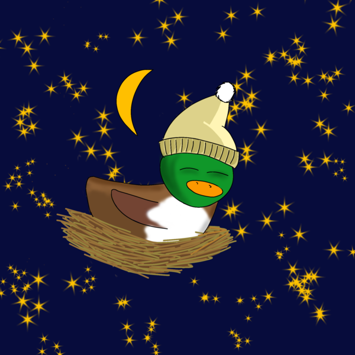

Il n'apparaît que pendant la [nuit](https://duckhunt.me/commands/settings/night_time). Les canards qui dorment sont de l'expérience gratuite : vous ne pouvez pas les manquer, mais certains canards sont encore éveillés... Bonne nuit !

## Super canards

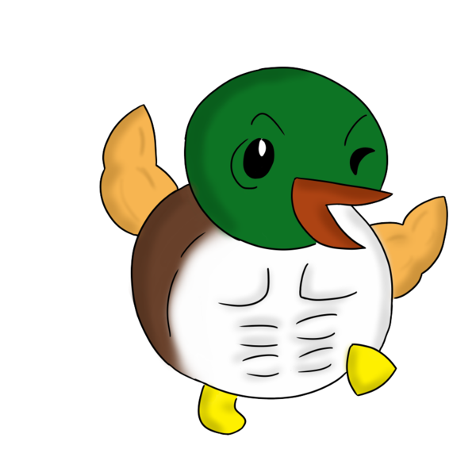

Les super canards sont des canards à vies multiples. Les tuer peut nécessiter plusieurs tirs, ou au moins des [munitions perforantes](https://duckhunt.me/commands/shop/ap) ou [explosives](https://duckhunt.me/commands/shop/explosive).

Cependant, avec un si grand nombre de vies, les tuer vous permettra [d'obtenir plus d'expérience](../bot-administration/edit-settings-settings-list.md#experience-related-settings) que d'habitude.

### Canards en armure

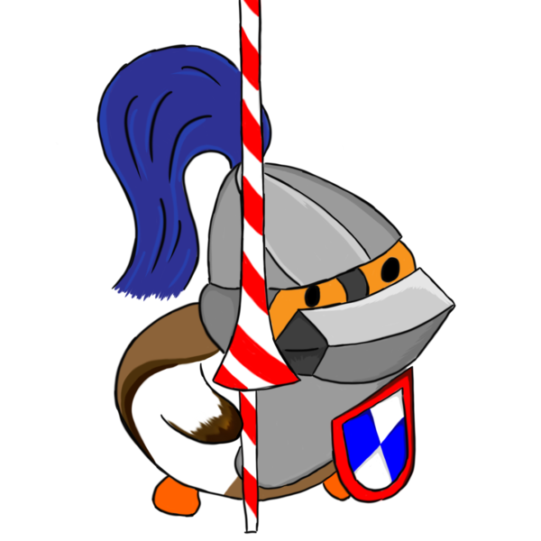

Ce canard résiste à 1 dmg à presque \(90%\) chaque tir. Pour le tuer, vous devez avoir au moins quelques munitions [AP](https://duckhunt.me/commands/shop/ap) équipées.

Pendant l'événement [Traité de l'ONU](events.md#traite-de-lonu), le canard blindé ne résiste pas aux tirs car cela serait injuste pour les chasseurs. Il se comportera alors comme un Super Canard normal, mais comptera toujours pour vos kills de canards en armure !

Vous pouvez voir sur votre page personnelle de chasseur \(`dh!me`\) le nombre de tirs auxquels un canard blindé a résisté.

## MOAD \(Mother Of All Ducks - Mère de tous les canards\)

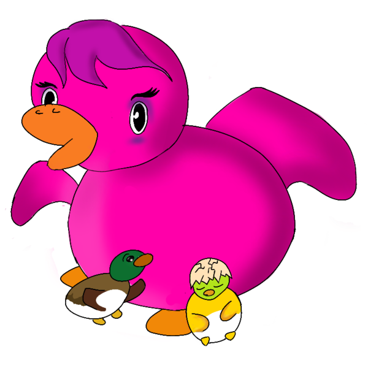

Les mères sont des super canards normaux qui, une fois tués, donnent naissance à deux nouveaux canards aléatoires. Les canards générés ne comptent pas dans le [paramètre ducks\_per_\__day](https://duckhunt.me/commands/settings/ducks_per_day) et peuvent être de n'importe quel type.

Si un bébé apparaît après que tu aies tué un MOAD, vérifie tes avancements ! Tu auras débloqué `Monstre`.

## Boss Canard 

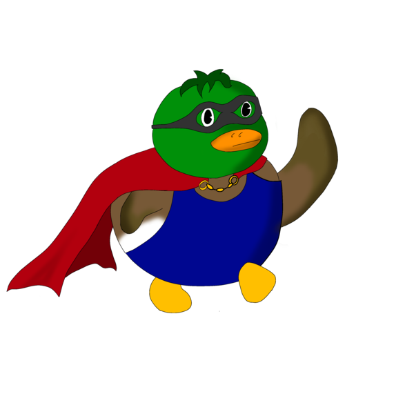

Le boss est un canard unique qui n'apparaîtra que sur le serveur de soutien officiel de DuckHunt. Lorsqu'il est tué, au lieu de recevoir de l'expérience, vous recevrez une lootbox \(boîte de foie gras\) dans votre inventaire. [Utilisez-le](https://duckhunt.me/commands/inventory/use) sur \([presque](https://duckhunt.me/commands/settings/allow_global_items)\) tous les canals.

