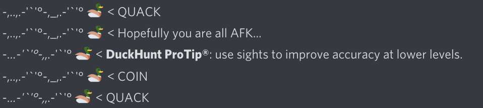
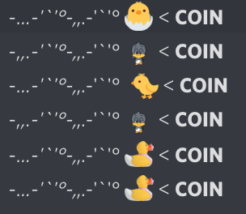
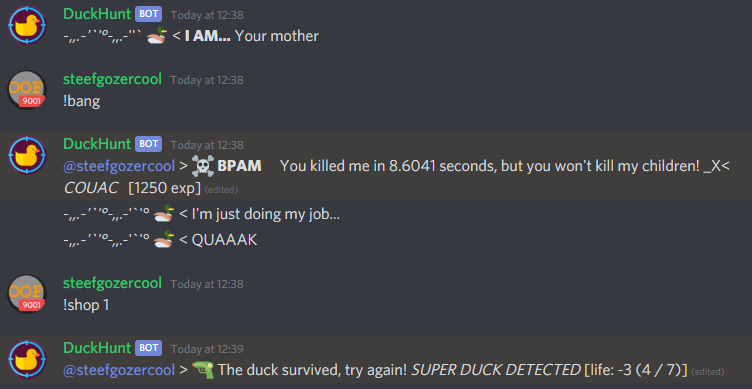

# Types of ducks

More details will be provided below the follwoing quick-refrerence table.

| Duck name | characteristics |
| :--- | :--- |
| Regular duck | Just your basic duck with 1 HP and awards the default 10XP. |
| Baby duck | You must hug the baby! shooting it will lose XP. |
| Super duck | A duck with more than 1 HP, a bit random how much, usually between 2-9, gives huge amounts of XP depending on the HP. |
| MOAD | Mother of all ducks, spawns 2 ducks when killed. |

### The regular ducks

The regular duck is the duck you'll find the most frequently. It has only one HP and can be killed in one shot. By default, this duck will award you 10 experience points.

### The babies

Babies aren't yet grown up, and so you shouldn't kill them to preserve later supplies of ducks. Show them some love with the `!hug` command instead.

Babies have special emotes, so you can recognise them easily. Also, they haven't learned to speak yet, so they always say **COIN!**

### The super ducks

Super ducks look just like regular ducks. Only when you shoot them do you see a message saying "The duck survived, try again! _SUPER DUCK DETECTED_"

Additionnaly, depending on the [settings](../bot-administration/edit-settings-settings-list.md) used on the server, they may also display the life they currently have when harmed.

To kill super ducks faster you can use [AP \(Armor Piercing\) ammo or explosive ammo](store-items.md), which do 2 or 3 damage respectively.

### The MOADs

**MOAD** stands for **M**other **O**f **A**ll **D**ucks, they spawn 2 ducks when killed.  
They always say "**I AM... Your mother"**

Children of the MOAD **do not count towards the `ducks_per_day`** parameter. Additionnaly, they may be of any type.

### The most rare ducks.

Sometimes, a **MOAD** can be a super duck. The odds are __1% \* 5% = 0,05% using the standard settings. That is roughly 1 in 2000 chance.

A **MOAD** could spawn 2 super ducks. The odds for that are _\(_5% \* 5%\)^2 = 0.000625% using the standard settings. Or 1 in 160 **thousand**.

But the rarest has to be a **MOAD** that spawns 2 **MOAD**s, this has a chance of \(1% \* 1%\)^2 = 0.000001% , or 1 in 100 **MILLION** chance.  
_You could get even more after this but it's more likely that you'd win the lottery at that point._

