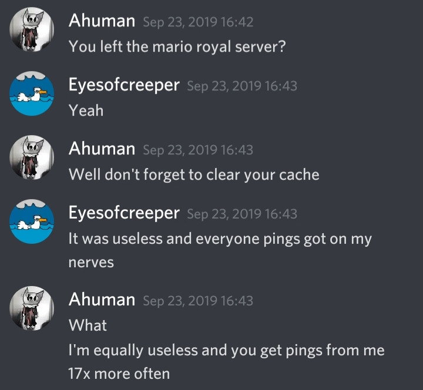

# "Clear Your Cache" Awareness

Eyes and Ahuman shared 23 mutual servers. When Ahuman noticed that the number had changed to 22, He discovered Eyes' grave sin.

Eyes had left the Discord server for Mario Royale, a browser game. Ahuman realized that since he left the server he will no longer get important pings regarding game updates, and he won't know when to clear his cache (which is required to do when the game has an update). Knowing this, Ahuman took it upon himself to make sure Eyes was aware of the important updates.

This was, if anything, a parody of Myynd#6484, who would DM Ahuman about random things, sometimes updates for roblox games or when exploits were found in roblox games. One time he told Ahuman that his PC was 13 Celsius. Without that information, Ahuman could have assumed his PC was much warmer....

## Escalation.

Eventually, along with him sending announcements personally, Ahuman would have other people send Eyes notifications as to when he should clear his cache. In the Mario Royale server, an @everyone ping would be deployed along with an image telling you to "clear your cache." Ahuman would have people send Eyes the image. The people Ahuman asked to do his dirty work ranged from mods and proficients to random people who just happen to be in the server. Eventually, Ahuman had the developer of Mario Royale message Eyes personally to remind him to clear his cache.
