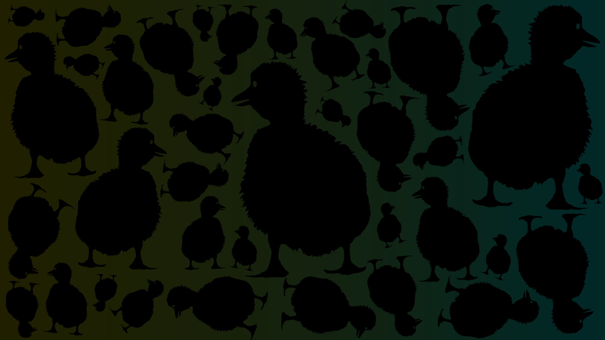

# Server History \(2016\)

      This recollection, especially of 2016, will be of notable events. They may be insignificant, but the person who is writing this only speaks English. Links to direct messages will be used, so it is best to be in the support server to use them.   the server was mostly dead for the first 4 months, only gaining traction around the time the 2nd version of DuckHunt was being released. Diagamma had deleted all of their messages on the server, and they were one of the most active users. That sucks. A lot. The majority of this information comes from \#general. 

The very first message, `!claimserver` in general was sent by Eyes on 6/22/2016. Olpouin was one of the first people in the server. I really hope someone who speaks French can write more about this part because I literally cant understand anything. 

 Outout
\#4039 claims him and eyes had discovered Discord API and the bot system in a minecraft server called "Bukkit.fr", and began to learn python. Both of them were 16 at the time. Interesting enough, Almost directly below the first message is an invite to a Minecraft server. Stone duck \(PierrePV\) can be seen talking in the server, so it's assumed he was from there or something. 

On 8/25, Eyes played with the Donald Trump bot. The bot was shot 3 times in \#game-all-time, and was removed on 7/2/17. The bot was used 23 times. 

Worse Augus\#9397 made the first racist joke in the server. He claimed the 6/6 2/2 weapon was made in china. 

Hey, I figured out if you copy and paste the date from discord, it looks like that \(below\) 

### 09/22/2016

OVH deactivated the anti DDoS. [http://travaux.ovh.net/?do=details&id=20421](http://travaux.ovh.net/?do=details&id=20421) This caused the bot to go down. OVH was one of europes top hosters. Eyes warned the bot may be taken down occasionally, and explained it was out of his control. 

### 10/29/2016

Eyes of creeper sent a hand reveal. 

### 11/01/2016



### 11/13/2016

DuckHunt-Beta\#0428 says "Prout" to eye's $kill command. 

### 11/14/2016

Eyes announces DuckHuntV2 is available for testing in \#tests, using DuckHunt-Beta. 

### 11/15/2016

Harry Potter talks in the server :0 He is happy because he can speak French

Not only does Harry Potter appear, but some interesting dialogue happens. It's in English so I can read it. Tomorrow is going to be the release of DuckHuntV2, and only 1 person has any hype.   
  
\(nobody says anything about the update the next day. I can't read French, is it postponed?\)

### 11/17/2016

Some people had their bots break because of the migration. LOL

### 11/19/2016



Ya know, Olpouin used to play the shit out of the bot. 

### 12/15/2016

This guy literally said the N-Word, then said   
  
Chaosmonk12/15/2016 

shrug  
No bot  
_fucks away_

### 12/20/2016



### 12/25/2016

Eyes said :smiley: probably 20 times that day. No joke. [https://discordapp.com/channels/195260081036591104/195260081036591104/262629479711637504](https://discordapp.com/channels/195260081036591104/195260081036591104/262629479711637504)

### 12/31/2016 

Eyes broadcasted  "  Bonneané — Happy New Year "

