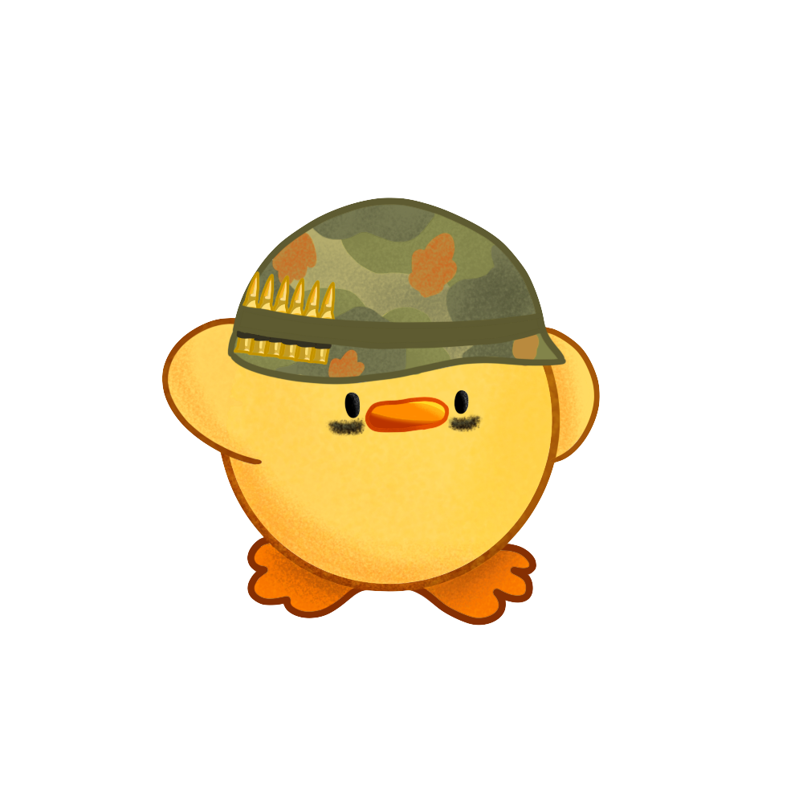

# Pourquoi chassons nous les canards ?

#### Il y a très, très longtemps, dans le lointain pays de DuckHunt, sur le continent de Discord...

Insérer _une musique sympa ici_

**Les canards ont déclaré la guerre à l'humanité**. Certains d'entre eux, en désaccord avec le Canard Suprême, se sont envolés du pays du Canard, aussi connu sous le nom de "Pond", et sont maintenant accueillis dans notre refuge spécial : \#duck・of・the・day.

Pendant ce temps, les autres canards continuaient à s'approcher de nous, mais heureusement, notre pays est protégé par de lourds murs, et il n'y a que deux endroits où ils peuvent s'approcher à portée de tir ;

*  \#🦆game・monthly・reset et
*  \#🦆game・all・time.

\#🦆game・monthly・reset a fait l'objet d'une expérience ratée, que nous ne pouvons toujours pas arrêter : chaque mois, les tireurs semblent perdre tous leurs souvenirs, et ne peuvent plus tirer. \(votre niveau se réinitialise\)

\#🦆game・all・time est l'autre endroit où les canards apparaissent. Gardez un œil sur eux !

\#🦆tests est un champ de bataille simulé pour les forces armées. Ici, chaque soldat peut demander plus de fonds, ce qui lui permet de faire des expériences sur les canards. Utilisez vos connaissances à bon escient !

Méfiez-vous de leurs [officiers](../players-guide/types-of-ducks.md) : les Super Canards sont encore plus puissants que leurs soldats ordinaires et peuvent encaisser quelques coups avant de mourir. Et puis il y a les MOADs. Non seulement ils sont aussi résistants que les Super Canards. Mais aussi, lorsqu'ils meurent, deux soldats vengeurs prennent leur place.

Grâce à un financement militaire important, nous avons maintenant accès à des balles perforantes et explosives, qui vous aideront à combattre ces monstres.

Les canards ennemis peuvent quitter le champ de bataille prématurément, car ils ne sont qu'en patrouille, ils doivent rester pendant un temps déterminé, puis ils désertent en raison de notre force écrasante.

Bonne chance, soldats. Maintenant que vous savez pourquoi vous vous battez, soyez courageux. Le Noduck aura peut-être pitié de vous.

--- Général Calgeka

