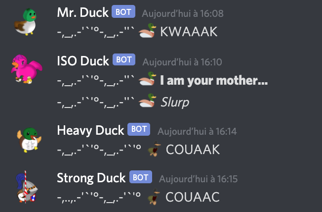
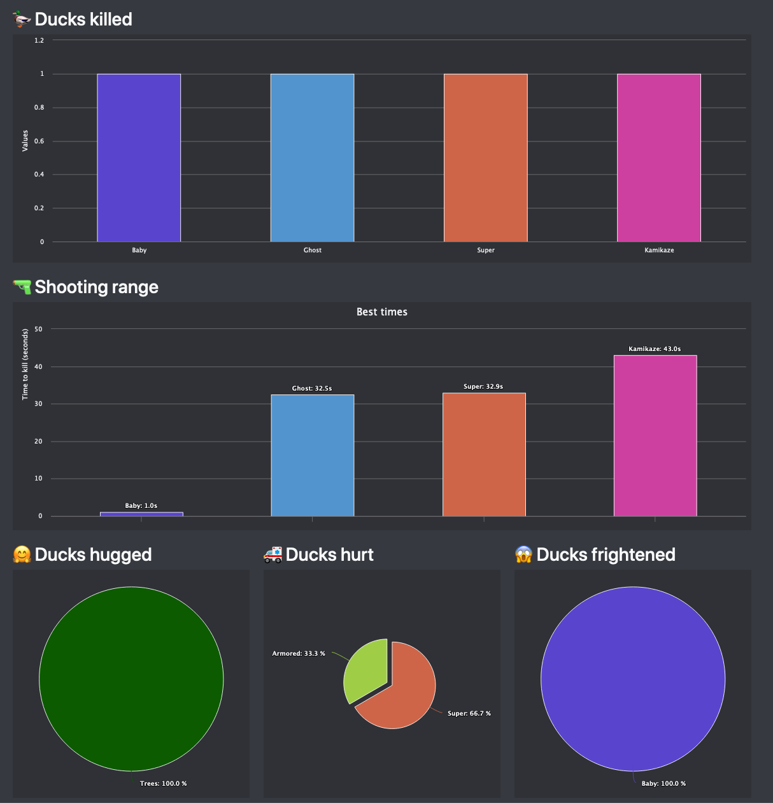
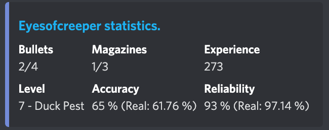
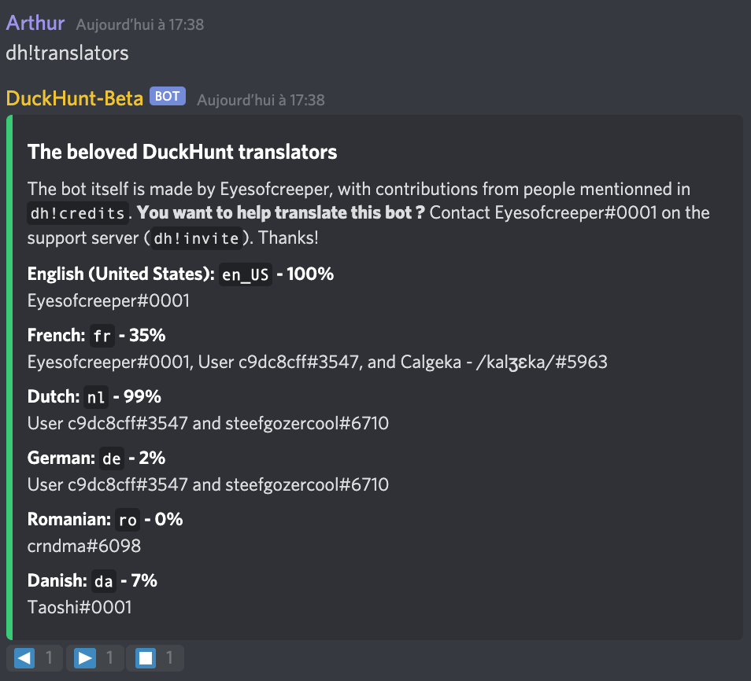

# Quelles sont les nouveautés de Duckhunt V4 ?

DuckHunt V4 est une réécriture complète du bot DuckHunt. En tant que tel, vous pouvez vous attendre à de nombreux changements, comme de nouveaux canards, de nouveaux événements, un meilleur leveling, et plus encore.

## Nouveau canards

Sur V3, il n'y avait que quelques types de canards :

* La [MOAD](players-guide/types-of-ducks.md#moad-mother-of-all-ducks) \(Mother of All Ducks, ou Mère de tous les Canards en français\)
* Le [Super Canard](players-guide/types-of-ducks.md#super-ducks)
* Le [Canard mécanique](players-guide/types-of-ducks.md#mechanical)
* Le [Canard normal](players-guide/types-of-ducks.md#normal-ducks)
* Le [Bébé canard](players-guide/types-of-ducks.md#baby)

Sur la V4, ces canards ont été conservés, et de nouveaux sont apparus :

* Le [Canard en Armure](players-guide/types-of-ducks.md#canards-en-armure) \(résiste à la plupart des tirs\)
* Le [Prof Canard](players-guide/types-of-ducks.md#prof-pr-duck) \(demande des calculs\)
* Le [Canard Doré](players-guide/types-of-ducks.md#canard-dore) et le [Canard en Plastique](players-guide/types-of-ducks.md#canard-en-plastique) \(qui valent respectivement plus et moins d'exp\)
* Le [Canard Kamikaze](players-guide/types-of-ducks.md#kamikaze) \(tue les autres canards\)
* Le [Canard Fantôme](players-guide/types-of-ducks.md#canard-fantome) \(n'envoie pas de messages quand il arrive\)
* Les canards de nuit : le [Canard de Nuit](players-guide/types-of-ducks.md#canard-de-la-nuit) et le [Canard Endormi](players-guide/types-of-ducks.md#canard-de-la-nuit).

### Le Boss Canard

Un autre type de canard est le Boss Canard. Il apparait dans le salon \#genetically-modified-ducks sur le serveur officiel de DuckHunt uniquement, et donne à tous ceux qui contribuent à le tuer une "Boîte de Foie Gras" qu'ils peuvent utiliser dans n'importe quel salon du jeu.

## Design


Pour que le nouveau design fonctionne, DuckHunt a besoin de la permission `manage_webhooks` dans son salon. Si vous voyez encore des canards à l'ancien design, demande à un admin de changer la permission, puis d'utiliser la commande  `dh!settings use_webhooks True` dans le salon.


Les Canards sont plus beaux grâce au pouvoir des webhooks: chaque canard a maintenant un avatar personnalisé \(fait par Calgeka - /kalʒɛka/\#5963\).

## Un site web tout neuf

Le site DuckHunt a pris un coup de frais. Plus de statistiques sont récupérées et affichées aux joueurs sur leur page personnelle, comme leur meilleur temps par type de canard et bien plus encore.

Vous y trouverez aussi la [liste des commandes](https://duckhunt.me/commands), une [documentation](https://duckhunt.me/fr/docs/) complète pour la V4, les informations [en direct](https://duckhunt.me) sur l'evènement en cours et le nombre de canards dans tout Discord, ainsi qu'une page de [statut](https://duckhunt.me/status) pour vérifier si le bot va bien !

## De nouveau objets dans la boutique

L'utilisation générale des objets de la boutique on été simplifiés, et certains nouveaux objets, comme le [chargeur auto](https://duckhunt.me/commands/shop/reloader) on été ajoutés.

## Un système de prestige

A nouveau système de prestige va aider le jeu à être amusant et différent, permettant d'obtenir des bonus uniques et exclusifs.

Le Prestige est un moyen pour vous de recommencer l'aventure DuckHunt, en faisant table rase sur votre avancement \(expérience, statistiques...\) En échange de votre remise à zéro, vous obtiendrez des objets exclusifs pour vous aider à avancer plus vite.

De plus amples détails [ici](https://app.gitbook.com/@duckhunt/s/duck-hunt-discord/~/drafts/-Mi5jK2ERQnbHzgQLJrV/v/french/players-guide/levels-and-experience#niveaux-de-prestige).

## De l'aide, des statistiques et bien plus

Si vous n'aimez pas d'ouvrir le site pour voir vos statistiques et la liste des commandes, DuckHunt V4 a prévu une chose pour vous : La commande [`dh!help`](https://duckhunt.me/commands/)vous envoie une liste de commandes, directement sur discord.

## Un salon à suivre pour voir les nouveaux événements et le freetime dans le chat


Cela demande un peu d'installation : Votre admin de serveur doit suivre le salon sur le discord DuckHunt pour tranférer les messages. Cela ne peut pas être automatisé par le bot.


Ne ratez pas les nouveaux événements en suivant le nouveaux salon \#🦆duckhunt-informations.

## Plus de canards

En utilisant les webhooks, nous pouvons réduire la pression sur DuckHunt, ainsi, vous pouvez maintenant régler le paramètre`duck_per_day` plus haut qu'avant. En somme, vous devriez pouvoir avoir deux fois plus de canards par jour, comparé à la V3.

## Un bot plus sable

Cette mise à jour devrait aussi rendre le bot plus stable, avec moins de dépendance sur les caches, des messages d'erreurs plus détaillés et moins de coupures en général. 

Avec l'usage des intents, le bot sera plus rapide pour répondre aux commandes que sa précédente version et devrait se retrouver débordé moins souvent.

## De nouvelles commandes

De nouvelles commandes comme [me](https://duckhunt.me/commands/me), [shooting\_stats](https://duckhunt.me/commands/shooting_stats), [best\_times](https://duckhunt.me/commands/best_times), [kills\_stats](https://duckhunt.me/commands/kills_stats), et bien plus ont été ajoutées aux bot. Serez-vous à même de toutes les [trouver](https://duckhunt.me/commands) ?

## Une API complète pour les développeurs 

Si vous voulez intégrer votre propre bot avec DuckHunt, cela n'a jamais été aussi facile. Vous pouvez vous lancer dedans et lire la [page de l'API DuckHunt](https://app.gitbook.com/@duckhunt/s/duck-hunt-discord/~/drafts/-Mi5jK2ERQnbHzgQLJrV/v/french/the-duckhunt-api/channels-scores-and-stats).

## Plus de paramétrages


Sur la V4, les paramètres ne sont plus **définis par serveurs**. La plupart d'entre eux sont personnalisables par salons ! Bonne nouvelle si vous avez deux salons Duckhunt ou plus dans votre serveur.


De nombreux paramètres ont été changé pour faciliter la mise en place d'un salon. Ceci inclut des [paramétrages prédéfinis ](https://duckhunt.me/commands/settings/templates) utilisés pour configurer un serveur très rapidement.

Pas d'inquiétude, vos paramètres de la V3 on été conservés, tout comme les scores des joueurs sur vos salons.

### Paramètres des Joueurs

Les joueurs peuvent aussi régler quelques préférences globales, comme leur [langage](https://duckhunt.me/commands/settings/my_language) préféré or s'ils veulent être [ping](https://duckhunt.me/commands/settings/ping) \(ou non\) par les messages envoyés par le bot.

## De meilleurs traductions

Les traductions ont été améliorées, avec des format de temps natifs et plus. Vous pouvez aussi voir les langues disponibles directement depuis Discord.

Bien sûr, vous pouvez toujours  [aider à la traduction ](players-guide/how-to-contribute-to-the-bot.md#translating-the-bot)si vous le désirez ! Pour cela, rejoignez le [serveur officiel](https://duckhunt.me/support) et demandez à traduire à Eyesofcreeper\#0001

